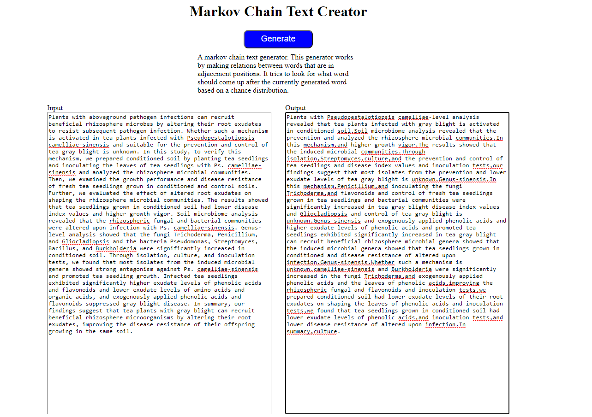

# Markov-Chain-Text-Generator
A web application to use to create new text based on a template text.
Do you like nonsense text? 
Do you want to fill pages with unqiue documentation that nowone reads but are a requirement text?
Well here is a small project that generates random text based on a given text (for context).
The algorithm used for the text generation is a 1 word history Markov Chain algorithm.
Here is an example.

Keep in mind, the longer the text provided the more gramatically correct sentences it creates.