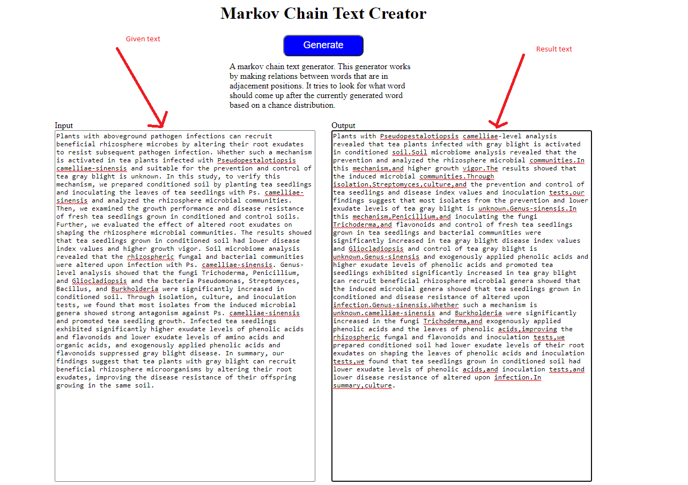

# Markov-Chain-Text-Generator
A web application to use to create new text based on a template text. 
Do you like nonsense text? 
Do you want to fill pages with unqiue documentation that nowone reads but are a requirement text? 
Well here is a small project that generates random text based on a given text (for context).
The algorithm used for the text generation is a 1 word history Markov Chain algorithm.
Here is an example.

Keep in mind, the longer the text provided the more gramatically correct sentences it creates.  
If you want to test go to  
https://soucupb.github.io/Markov-Chain-Text-Generator/